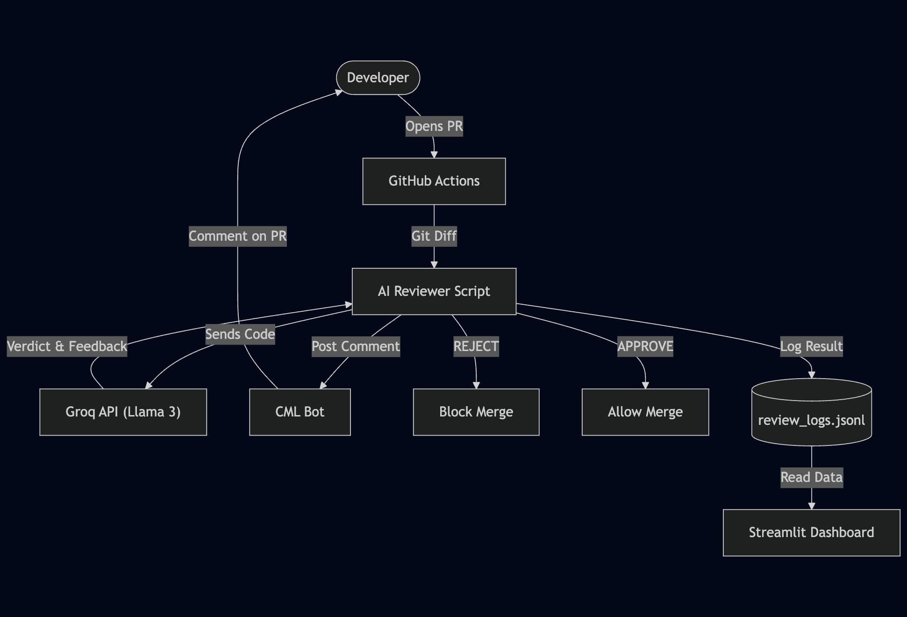
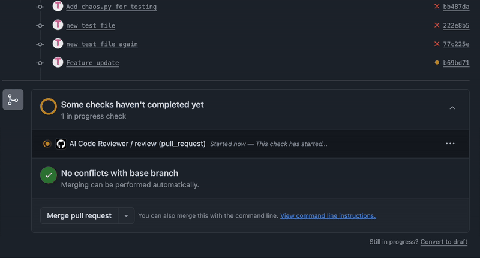
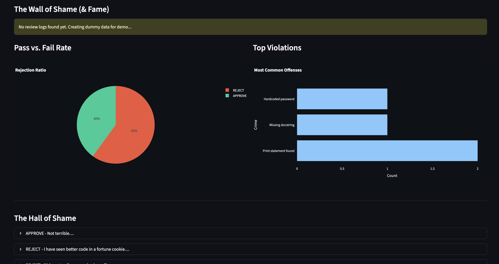

# Sentinel-CI: AI-Powered Code Reviewer

**Automated Code Quality Gate using GitHub Actions and Groq API.**


## Overview

Sentinel-CI is a CI/CD integration that automates code reviews for Pull Requests. It leverages the Groq API (Llama-3 model) to analyze code changes against a set of predefined quality assurance rules.

Functionality:
1.  **Analysis**: Scans git diffs for issues such as debug print statements, missing documentation, or security risks.
2.  **Enforcement**: Blocks the merge if critical issues are found.
3.  **Feedback**: Posts a structured review comment on the Pull Request, including specific issue identification and a summary.
4.  **Logging**: Records review outcomes to a local log file for visualization.

## Architecture



## Demo


> *The AI detects issues in `chaos.py` and blocks the PR with a review comment.*

## Dashboard



The project includes a Streamlit dashboard to visualize review statistics and metrics.

**Run the dashboard locally:**
```bash
streamlit run dashboard.py
```

**Metrics Tracked:**
- **Pass/Fail Ratio**: Percentage of approved vs. rejected PRs.
- **Common Violations**: Frequency of specific issues (e.g., "Missing Docstrings").
- **Review Log**: A history of recent reviews and their outcomes.

## Setup Guide

### 1. Prerequisites
- GitHub account
- [Groq Cloud](https://console.groq.com/) API Key

### 2. Installation
1.  Fork or clone this repository.
2.  Install dependencies locally (required for running the dashboard):
    ```bash
    pip install -r requirements.txt
    ```

### 3. Configuration
Navigate to GitHub Repo -> **Settings** -> **Secrets and variables** -> **Actions** -> **New Repository Secret**.

| Name | Value |
|------|-------|
| `GROQ_API_KEY` | Your Groq API Key |

### 4. Usage
The workflow is triggered automatically on Pull Requests targeting the main branch.

**Test Case:**
Pushing code containing `print()` statements will trigger a rejection.

```python
def example_function():
    print("debug") # Use this to test the rejection logic
    return True
```

## Project Structure
- `.github/workflows/`: CI pipeline configuration.
- `scripts/ai_reviewer.py`: Core logic for API interaction and code analysis.
- `dashboard.py`: Statistical visualization interface.
- `requirements.txt`: Project dependencies.
